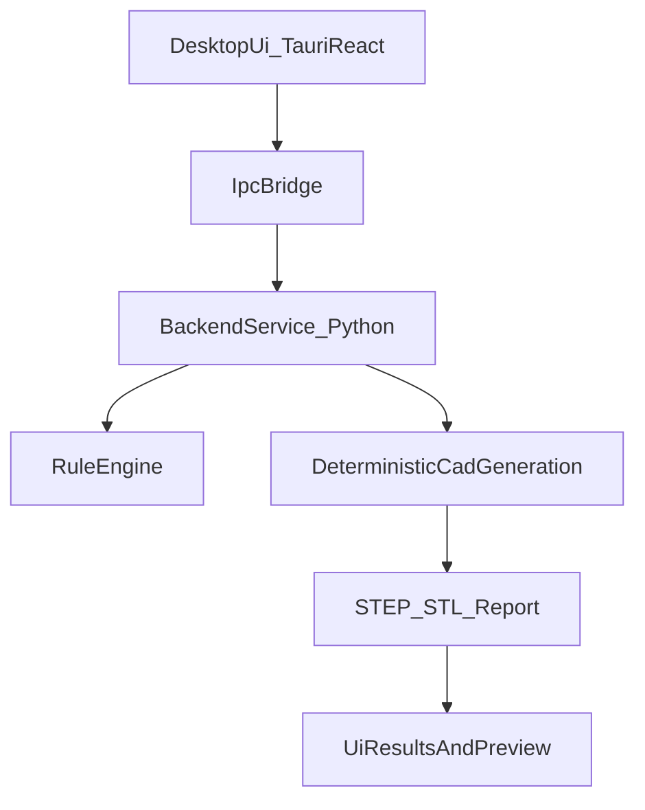

# ADR-001: Milestone 1 Architecture Baseline

## Status

Accepted

## Date

2026-04-23

## Context

RoboForgeAI is moving from CLI-only tooling to a no-terminal desktop MVP for non-technical users.
Milestone 0 requires explicit technical decisions so Milestone 1 execution is consistent.

## Decision Summary

1. UI framework: **Tauri + React + TypeScript**
2. AI boundary (M1): **No mandatory AI dependency in generation path**
3. Project format: **Versioned JSON project file**
4. Preview/rendering (M1): **Lightweight file-based preview workflow**
5. Privacy/telemetry: **Opt-in telemetry, local-first defaults**

## Decision 1: UI Framework

### Decision

Use **Tauri + React + TypeScript** for the desktop app shell.

### Rationale

- Cross-platform desktop packaging with lighter runtime than Electron.
- Strong UI ecosystem for guided forms/wizards.
- Clean separation between frontend and Python generation service.

### Consequences

- Need IPC contract between UI and backend worker/service.
- Need installer pipeline for supported platforms.

## Decision 2: AI Boundary for M1

### Decision

M1 generation must remain deterministic and fully functional without cloud AI.

AI (if present) is optional and only assists with input preparation.

### Rationale

- Reduces reliability risk for first user-facing release.
- Keeps engineering trust model clear: deterministic core owns outputs.

### Consequences

- Prompt-to-parameter assistant is deferred to Milestone 3.
- M1 UI focuses on forms/templates rather than free-form generation.

## Decision 3: Project File Format

### Decision

Use a versioned JSON container, default extension `.rfa.json`.

Top-level fields:

- `schema_version`
- `project`
- `inputs`
- `generation_profile`
- `outputs`
- `metadata`

### Rationale

- Explicit schema version supports future migrations.
- Human-readable and compatible with app/backend tooling.

### Consequences

- Add migration helpers when schema changes.
- Keep generation spec mapping deterministic from project JSON to backend input model.

## Decision 4: Preview/Rendering in M1

### Decision

For M1, use lightweight preview based on generated artifacts:

- Show file list and metadata immediately
- Optional embedded 3D preview for STL where feasible
- Defer deep CAD-native editing/scene graph interactions

### Rationale

- Avoid overloading M1 with full geometry viewer complexity.
- Keep focus on successful design-to-export workflow.

### Consequences

- Users rely on downstream CAD tools for advanced inspection/editing.
- Advanced interactive assembly visualization moves to later milestones.

## Decision 5: Privacy and Telemetry

### Decision

- Local-first defaults for generation and project files.
- Telemetry is opt-in and anonymized.
- No automatic upload of CAD/project content.

### Rationale

- Non-technical and professional users expect data control.
- Lowers adoption friction for labs/startups with confidentiality concerns.

### Consequences

- Need explicit consent flow in onboarding.
- Need telemetry schema and retention policy documentation.

## Architecture Snapshot

## Rejected Alternatives

- **Electron desktop shell**: higher runtime footprint; acceptable fallback, but not chosen first.
- **Web-only first**: increases hosting/auth complexity and weakens local-first privacy posture for M1.
- **Cloud-AI-first generation**: too high reliability/trust risk for initial non-technical release.

## Implementation Notes (M1)

- Define IPC contract first (`start_generation`, `get_job_status`, `get_artifacts`).
- Keep backend runner isolated from UI process crashes.
- Standardize error categories for UX:
  - input_validation_error
  - generation_failure
  - export_failure
  - unknown_error

## Related Documents

- `docs/requirements_v2.md`
- `docs/roadmap_24m.md`
- `docs/m1_implementation_plan.md`

