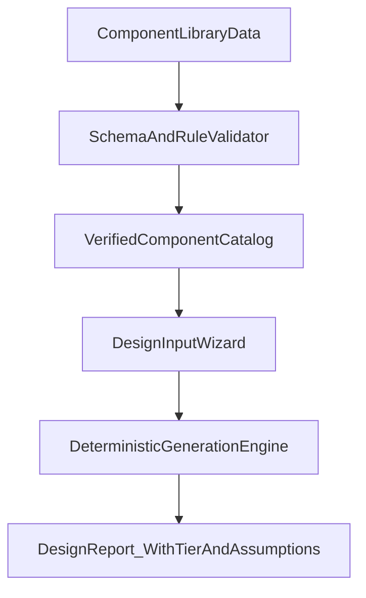

# ADR-002: Component Library Strategy

## Status

Accepted

## Date

2026-04-23

## Context

RoboForgeAI V1 focuses on enclosure/mount generation for real components.
To produce useful designs, the system needs a reliable source of truth for component dimensions, mounting patterns, keep-out zones, and fit constraints.

Without a structured component library, generation quality and trust degrade quickly.

## Decision Summary

1. Use a **versioned internal component library schema**.
2. Keep **curated first-party component packs** for V1.
3. Support **user-defined custom components** via guided forms.
4. Define **validation tiers** for component data quality.
5. Treat the component library as a **product artifact** with semantic versioning.

## Decision 1: Canonical Library Schema

### Decision

Store components as JSON records with explicit schema versioning.

Required baseline fields:

- `component_id`
- `name`
- `category`
- `manufacturer`
- `part_number`
- `units`
- `overall_dimensions`
- `mounting_features`
- `keepout_zones`
- `connector_zones` (if applicable)
- `recommended_fasteners`
- `metadata` (source, confidence, revision)

### Rationale

- Enables deterministic generation across templates.
- Keeps data model portable across desktop app and future plugin adapters.

### Consequences

- Requires schema validation and migration handling.
- Requires strict unit consistency rules.

## Decision 2: Curated First-Party Packs in V1

### Decision

Ship V1 with curated packs for high-frequency mechatronics components:

- SBCs (e.g., Raspberry Pi family)
- common motor classes (e.g., NEMA17-sized patterns)
- battery form factors
- standard sensors and controller boards
- common fasteners/standoffs

### Rationale

- Faster trust-building than open ingestion of noisy external datasets.
- Focuses on practical jobs-to-be-done for early pilots.

### Consequences

- Initial catalog is smaller but higher quality.
- Need a clear backlog process to add requested components.

## Decision 3: User-Defined Custom Components

### Decision

Allow users to add custom components via a guided form workflow.

Minimum required for custom components:

- bounding box
- mounting hole locations and diameters
- keep-out region(s)
- preferred fastening method

### Rationale

- Covers long-tail needs without waiting for official catalog updates.
- Preserves accessibility for non-CAD-heavy users.

### Consequences

- Need robust UX validation to prevent invalid geometry definitions.
- Must clearly label custom components as user-asserted data.

## Decision 4: Validation Tiers

### Decision

Classify component records into tiers:

- **Tier A**: vendor-documented and verified geometry/constraints
- **Tier B**: community/user-contributed with internal checks
- **Tier C**: draft/unverified data

Generation and report behavior:

- Tier A: full trust baseline for automated suggestions
- Tier B: allow generation with warnings
- Tier C: strict warning banner and reduced automatic assumptions

### Rationale

- Communicates confidence clearly.
- Aligns with engineering trust and risk disclosure requirements.

### Consequences

- Need QA workflow to promote records across tiers.
- Reporting must include data tier per component used.

## Decision 5: Versioning and Release Model

### Decision

Version component library independently from app code:

- semantic versioning for library (`major.minor.patch`)
- changelog entries for added/changed/deprecated components
- migration notes when dimensions/mount patterns change

### Rationale

- Avoids silent behavior drift in generated designs.
- Supports reproducibility for project files over time.

### Consequences

- Project files must store referenced component library version.
- Need compatibility policy for old projects.

## Data Flow Snapshot

## Rejected Alternatives

- **Free-form user CAD import only**: too complex for non-technical V1 users.
- **Rely on LLM to infer component dimensions from text**: high risk and low reliability.
- **Uncurated open catalog first**: poor data quality and trust problems.

## Implementation Notes (M1-M2)

- Add schema validator and unit normalizer first.
- Build curated seed pack for top 20-50 components used in pilot interviews.
- Include component tier/confidence in every generated report.
- Add "request new component" workflow in product backlog.

## Related Documents

- `docs/requirements_v2.md`
- `docs/roadmap_24m.md`
- `docs/m1_implementation_plan.md`
- `docs/adr_001_m1_architecture.md`
