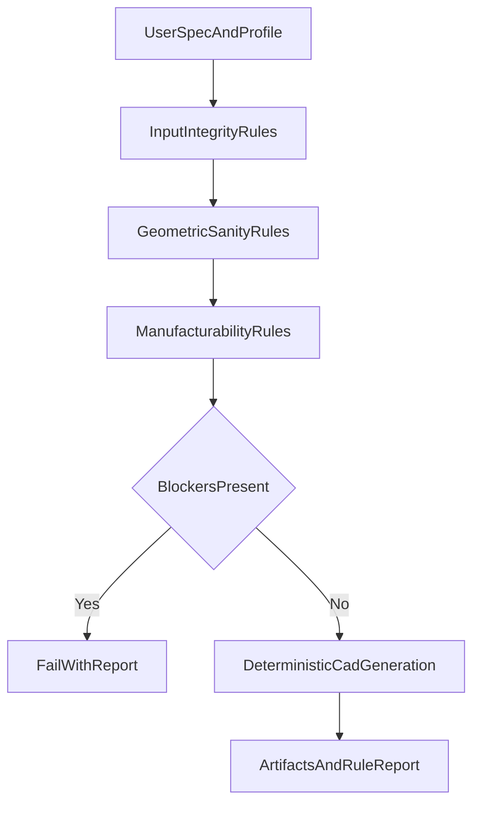

# ADR-003: Engineering Rule Engine Policy

## Status

Accepted

## Date

2026-04-23

## Context

RoboForgeAI must provide trustworthy, manufacturable CAD outputs.
The deterministic CAD kernel alone is not sufficient; generated designs require explicit engineering rule checks and clear fail/allow behavior.

This ADR defines how rules are structured, executed, and reported.

## Decision Summary

1. Use a **policy-driven rule engine** with explicit severity levels.
2. Define **hard veto rules** and **soft advisory rules**.
3. Run rules in staged categories from input -> geometry -> manufacturability.
4. Require **traceable rule reports** in every generation output.
5. Support **profile-based rules** by process/material/domain.

## Rule Model

Each rule record must include:

- `rule_id`
- `name`
- `category`
- `severity`
- `description`
- `inputs_required`
- `check_logic_ref`
- `pass_condition`
- `failure_message`
- `suggested_fixes`
- `applicable_profiles`
- `version`

## Severity Levels and Actions

### Blocker

- Meaning: design is invalid/unsafe for stated assumptions.
- Action: generation/export is blocked until resolved.
- Example: negative thickness, impossible transform, missing required mounting reference.

### Warning

- Meaning: design may be manufacturable but has risk.
- Action: generation allowed with explicit warning and mitigation guidance.
- Example: thin wall near minimum threshold, unsupported overhang risk for FDM.

### Info

- Meaning: non-failing suggestion for quality or cost improvement.
- Action: generation continues; recommendation listed in report.
- Example: suggest standard fastener size to reduce BOM complexity.

## Rule Categories and Execution Order

1. **Input Integrity Rules**
  - schema validity
  - units normalization
  - required parameters/components
2. **Geometric Sanity Rules**
  - non-self-contradictory dimensions
  - transform validity
  - clearance/fit minimum checks
3. **Manufacturability Rules**
  - process-profile checks (FDM/CNC/sheet-metal baseline)
  - wall thickness, hole-feature constraints
  - print orientation/support heuristics (where applicable)
4. **Assembly/Integration Rules** (as milestones progress)
  - interference checks
  - component keep-out and connector access
  - motion envelope constraints

Execution must stop on first unresolved Blocker category result.

## Veto Logic

- Any unresolved `Blocker` rule result vetoes export.
- Warnings never auto-veto, but must be surfaced in:
  - UI result summary
  - generated design report
- User overrides are allowed for selected Warnings only, never for Blockers.

## Profile-Based Policy

Rules are activated by profile combinations:

- manufacturing process (FDM, CNC, etc.)
- material family (e.g., PLA-like, aluminum-like)
- use-case domain (enclosure, mount, adapter)

Default V1 profile:

- process: FDM
- domain: enclosure/mount/adapter
- conservative thresholds

## Reporting Contract

Each generation must emit a structured rule report:

- profile used
- rule version set
- list of passed/failed rules
- blocker/warning counts
- recommended fixes
- unresolved risk summary

This report is required output alongside STEP/STL artifacts.

## Governance and Versioning

- Rules are versioned and changelogged.
- Threshold changes require rationale notes.
- Regression tests must cover core rule set.
- Project files should record rule-engine version used during generation.

## Data Flow Snapshot

## Rejected Alternatives

- **Single pass/fail flag without severity**: poor UX and weak engineering transparency.
- **Allow user override of all failures**: unsafe and undermines trust model.
- **Hardcode thresholds in UI only**: not versionable, not testable, and not auditable.

## Implementation Notes (M1-M3)

- Start with a compact ruleset for enclosure/mount templates.
- Add a rule registry and deterministic evaluation order.
- Include clear remediation text per rule to support non-technical users.
- Expand assembly and integration rule depth in later milestones.

## Related Documents

- `docs/requirements_v2.md`
- `docs/roadmap_24m.md`
- `docs/m1_implementation_plan.md`
- `docs/adr_001_m1_architecture.md`
- `docs/adr_002_component_library.md`

