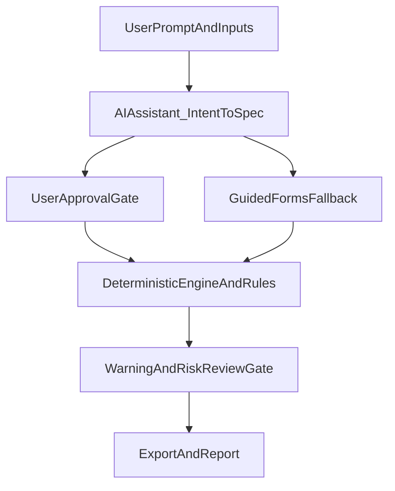

# ADR-004: AI Assistant Governance Policy

## Status

Accepted

## Date

2026-04-23

## Context

RoboForgeAI aims to use AI to accelerate design intent capture, but must preserve engineering reliability and user trust.
The AI assistant must not bypass deterministic constraints or present uncertain outputs as validated engineering decisions.

This ADR defines allowed AI responsibilities, hard boundaries, and required human approval gates.

## Decision Summary

1. AI acts as an **intent-to-spec assistant**, not final authority.
2. Deterministic engine + rule checks remain the **single source of engineering truth**.
3. AI outputs must include confidence and rationale metadata.
4. High-impact AI suggestions require explicit human approval.
5. Safe fallback paths are mandatory when AI confidence is low or unavailable.

## Allowed AI Responsibilities (V1-V3)

- Parse user prompt/context into structured design inputs.
- Suggest parameter defaults and alternatives.
- Explain tradeoffs in plain language.
- Propose corrections for failed rule checks.
- Generate draft requirement summaries for user confirmation.

## Disallowed AI Responsibilities

- Declaring design as certified/safe for production use.
- Overriding deterministic Blocker rules.
- Auto-exporting designs when unresolved Blockers exist.
- Inventing component dimensions when trusted data is missing without explicit warning and user confirmation.

## Decision Authority Model

### AI Layer

- Produces candidate structured inputs with confidence score and rationale.

### Deterministic Layer

- Validates schema, applies engineering rules, generates geometry, produces reports.

### Human Layer

- Reviews and approves AI-translated intent before generation.
- Resolves warnings/assumptions before final export.

## Confidence and Approval Policy

Confidence tiers:

- **High**: AI draft may be pre-filled, still requires user confirmation.
- **Medium**: AI draft requires user review of highlighted assumptions.
- **Low**: system requests clarifying inputs before generation.

Mandatory approval gates:

1. Prompt-to-spec confirmation gate (before generation)
2. Warning/risk review gate (before export)

No auto-bypass of these gates in V1-V3.

## Safe Fallback Behavior

When AI is unavailable, low-confidence, or errors:

- fall back to guided forms/templates
- preserve user progress
- show actionable next step guidance
- continue deterministic generation path if required inputs are complete

The product must remain usable without AI services.

## Prompt and Output Governance

AI interactions must:

- avoid claims of guaranteed engineering safety
- surface assumptions clearly
- distinguish known data vs inferred guesses
- use constrained output schema for intent translation

Recommended metadata in AI result objects:

- `confidence_score`
- `assumptions`
- `missing_inputs`
- `alternatives`
- `rationale`

## Auditability and Traceability

Generation record must capture:

- AI interaction identifier/version (if AI used)
- translated input snapshot approved by user
- rule report and deterministic engine version
- final outputs and unresolved warnings at export time

This enables reproducibility and incident review.

## Privacy and Security Constraints

- Do not send project-sensitive CAD payloads to cloud AI by default.
- Use minimum necessary prompt context.
- Respect user/org telemetry and data-sharing settings.
- Maintain clear policy docs for data retention and deletion.

## Data Flow Snapshot

## Rejected Alternatives

- **AI-first autonomous export**: unacceptable trust/safety risk.
- **No confidence/assumption metadata**: weak explainability and poor user control.
- **Hard dependence on cloud AI**: brittle UX and weak privacy posture.

## Implementation Notes (M2-M4)

- Add constrained schema for AI prompt-to-spec translation.
- Build confidence-aware UI highlighting uncertain fields.
- Implement approval gates as explicit workflow states.
- Ensure full deterministic fallback path for all templates.

## Related Documents

- `docs/requirements_v2.md`
- `docs/roadmap_24m.md`
- `docs/m1_implementation_plan.md`
- `docs/adr_001_m1_architecture.md`
- `docs/adr_002_component_library.md`
- `docs/adr_003_rule_engine_policy.md`
