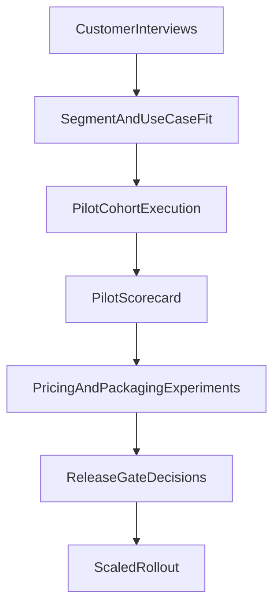

# ADR-005: Pilot Program and Go-to-Market Validation Policy

## Status

Accepted

## Date

2026-04-23

## Context

RoboForgeAI has a strong technical roadmap, but product and business risk must be reduced in parallel.
To avoid building in a vacuum, the team needs a repeatable validation process covering:

- customer discovery interviews
- pilot execution quality
- pricing and packaging experiments
- release progression gates tied to evidence

This ADR defines the standard operating model for market validation.

## Decision Summary

1. Run a structured interview protocol before broad pilot rollout.
2. Execute pilots in staged cohorts with explicit success metrics.
3. Validate pricing through controlled experiments, not assumptions.
4. Use evidence-based release gates (alpha -> pilot -> paid pilot -> general availability).
5. Track product and business metrics in a unified pilot scorecard.

## Interview Protocol

### Target Segments (initial)

- hardware startups
- research labs/university builders
- automation/system integration teams

### Interview Objectives

- confirm frequency of enclosure/mount/adapter needs
- quantify current workflow time/cost
- identify highest-cost failure modes (fit, printability, thermal, assembly)
- validate required outputs (STEP/STL/report/BOM notes)
- assess willingness to adopt and pay

### Minimum Sample

- 15-20 interviews total
- at least 5 per primary segment

### Required Interview Data Capture

- organization type and team size
- role of interviewee
- use-case examples from last 30-90 days
- current tools and process steps
- time-to-delivery and rework frequency
- economic impact estimate
- stated purchase/adoption criteria

### Exit Criteria (Interview Stage)

Proceed to pilot expansion only if:

- repeated high-frequency pain is confirmed across segments
- clear evidence of meaningful time/cost burden exists
- at least one segment shows strong willingness to run pilots

## Pilot Program Design

### Cohort Structure

- Cohort 1: Design partners (high-touch, weekly feedback)
- Cohort 2: Broader pilot users (medium-touch, standardized onboarding)

### Pilot Duration

- 4-8 weeks per cohort wave

### Pilot Entry Requirements

- signed pilot agreement and scope
- defined success criteria per account
- baseline metrics from pre-pilot process

### Pilot Success Metrics (Core)

- time-to-first-valid-design
- export completion rate
- first-pass fit/manufacturability success
- manual CAD time reduction
- user confidence/trust score
- weekly active usage

### Pilot Success Thresholds (Program)

- >= 80% users complete core workflow without terminal support
- >= 70% first-pass fit success in scoped use cases
- >= 50% reduction in manual CAD effort for repeated tasks
- sustained weekly usage by pilot teams

## Pricing and Packaging Experiments

### Principle

Do not finalize pricing before observing value realization in pilots.

### Experiment Tracks

1. **Per-design pricing**
   - test willingness for transaction-based value
2. **Seat/subscription pricing**
   - test ongoing usage economics for teams
3. **Hybrid model**
   - base subscription + usage tiering

### Evaluation Criteria

- conversion from pilot to paid
- revenue per active team
- support burden per pricing model
- churn risk indicators

### Guardrails

- avoid underpricing engineering value
- avoid complex pricing in early stages
- maintain transparent limits and included outputs

## Release Gates

### Gate 1: Alpha Internal

Requirements:

- deterministic generation and report flow stable
- blocker/warning policy functioning
- core onboarding flow demonstrated internally

### Gate 2: External Pilot

Requirements:

- interview stage exit criteria met
- pilot instrumentation enabled
- support and feedback loop staffed

### Gate 3: Paid Pilot

Requirements:

- pilot success thresholds met in at least one segment
- pricing experiment shows credible willingness to pay
- repeatable onboarding and support playbook exists

### Gate 4: General Availability (Scoped)

Requirements:

- paid pilot retention trend is positive
- product quality metrics remain stable under higher usage
- release and incident response processes are operational

## Scorecard and Governance

Maintain a single pilot scorecard reviewed on a fixed cadence (weekly pilot review, monthly gate review):

- product KPIs
- business KPIs
- trust/safety incidents
- top requested capabilities
- reasons for pilot failure or churn risk

Decisions to expand scope must reference scorecard evidence.

## Data Flow Snapshot

## Rejected Alternatives

- **Build-first, validate-later**: high risk of product-market mismatch.
- **Single pilot metric only**: misses trust, usage quality, and economic viability.
- **One-shot pricing decision**: weak basis for sustainable GTM.

## Implementation Notes

- Create interview template and pilot intake form before recruitment.
- Instrument product events needed for pilot metrics from day one.
- Pair qualitative feedback with objective usage/export data.
- Keep early segment focus narrow (enclosure/mount/adapter jobs).

## Related Documents

- `docs/requirements_v2.md`
- `docs/roadmap_24m.md`
- `docs/m1_implementation_plan.md`
- `docs/adr_001_m1_architecture.md`
- `docs/adr_002_component_library.md`
- `docs/adr_003_rule_engine_policy.md`
- `docs/adr_004_ai_governance.md`
