# IPC Flow Diagram

This diagram shows how UI/IPC calls move through API wrappers, job orchestration, and CAD generation.

```mermaid
sequenceDiagram
    autonumber
    participant UI as UI / IPC Caller
    participant API as ipc_api.py
    participant SVC as BuildService (app_service.py)
    participant TH as Worker Thread
    participant CLI as build() (cli.py)
    participant IO as project_io.py

    alt Start from spec path
        UI->>API: api_start_generation(service, spec_path, outdir)
        API->>SVC: start_generation(spec_path, outdir)
    else Start from project file
        UI->>API: api_start_generation_from_project(service, project_path)
        API->>SVC: start_generation_from_project(project_path)
        SVC->>IO: load_project(project_path)
        IO-->>SVC: validated project dict
        SVC->>SVC: start_generation(spec_path, outdir)
    end

    SVC->>SVC: create JobRecord(status="queued")
    SVC->>TH: spawn _run_job(job_id)
    SVC-->>API: job_id
    API-->>UI: {ok: true, data: {job_id}}

    TH->>SVC: mark running + started_at
    TH->>CLI: build(spec_path, outdir)
    CLI-->>TH: project_outdir or exception

    alt build success
        TH->>SVC: mark succeeded + project_outdir + finished_at
    else build failure
        TH->>SVC: mark failed + error + finished_at
    end

    loop Poll status
        UI->>API: api_get_job_status(service, job_id)
        API->>SVC: get_job_status(job_id)
        SVC-->>API: JobRecord as dict
        API-->>UI: {ok: true, data: status}
    end

    UI->>API: api_get_artifacts(service, job_id)
    API->>SVC: get_artifacts(job_id)
    SVC-->>API: files list (if succeeded)
    API-->>UI: {ok: true, data: artifacts}

    opt Dashboard first load
        UI->>API: api_get_ui_bootstrap(service, recent_failure_limit, timeline_limit)
        API->>SVC: get_ui_bootstrap(...)
        SVC->>SVC: get_home_snapshot(...) + get_job_timeline(...)
        SVC-->>API: home + timeline payload
        API-->>UI: {ok: true, data: bootstrap}
    end

    opt Job details panel
        UI->>API: api_get_job_details(service, job_id)
        API->>SVC: get_job_details(job_id)
        alt job succeeded
            SVC->>SVC: get_job_status + get_artifacts + get_run_metadata
            SVC-->>API: status + artifacts + run_metadata
        else job not succeeded
            SVC->>SVC: get_job_status
            SVC-->>API: status + null artifacts/metadata
        end
        API-->>UI: {ok: true, data: details}
    end

    opt Retry failed/old job
        UI->>API: api_retry_job(service, old_job_id)
        API->>SVC: retry_job(old_job_id)
        SVC->>SVC: get_job_status(old_job_id)
        SVC->>SVC: start_generation(spec_path, outdir)
        SVC-->>API: new_job_id
        API-->>UI: {ok: true, data: {job_id: new_job_id}}
    end

    opt Cleanup old finished jobs
        UI->>API: api_prune_jobs(service, keep_recent)
        API->>SVC: prune_jobs(keep_recent)
        SVC->>SVC: remove older succeeded/failed/cancelled jobs
        SVC-->>API: removed_count + removed_job_ids
        API-->>UI: {ok: true, data: prune_result}
    end

    opt Delete one finished job
        UI->>API: api_delete_job(service, job_id)
        API->>SVC: delete_job(job_id)
        alt job queued/running
            SVC-->>API: RuntimeError
            API-->>UI: {ok: false, error: generation_failure}
        else job finished
            SVC->>SVC: remove job from in-memory store
            SVC-->>API: deleted_job_id
            API-->>UI: {ok: true, data: deleted_job_id}
        end
    end

    opt Live active-jobs panel
        UI->>API: api_get_active_jobs(service, limit)
        API->>SVC: get_active_jobs(limit)
        SVC->>SVC: list queued/running jobs
        SVC-->>API: active jobs
        API-->>UI: {ok: true, data: {jobs}}
    end

    opt Clear all finished jobs
        UI->>API: api_clear_finished_jobs(service)
        API->>SVC: clear_finished_jobs()
        SVC->>SVC: prune_jobs(keep_recent=0)
        SVC-->>API: removed_count + removed_job_ids
        API-->>UI: {ok: true, data: clear_result}
    end

    opt Bulk delete selected jobs
        UI->>API: api_delete_jobs(service, job_ids)
        API->>SVC: delete_jobs(job_ids)
        loop each selected job_id
            SVC->>SVC: delete_job(job_id)
            alt deletable finished job
                SVC->>SVC: remove job
            else running/queued/missing
                SVC->>SVC: collect per-job error
            end
        end
        SVC-->>API: deleted_count + deleted_job_ids + errors[]
        API-->>UI: {ok: true, data: bulk_delete_result}
    end

    opt App startup capability check
        UI->>API: api_get_backend_capabilities(service)
        API->>SVC: get_backend_capabilities()
        SVC-->>API: api_version + supported features
        API-->>UI: {ok: true, data: capabilities}
    end

    opt App startup health ping
        UI->>API: api_get_backend_health(service)
        API->>SVC: get_backend_health()
        SVC->>SVC: collect job counters + status
        SVC-->>API: status + api_version + counts
        API-->>UI: {ok: true, data: health}
    end

    opt App contract summary check
        UI->>API: api_get_contract_summary(service)
        API->>SVC: get_contract_summary()
        SVC-->>API: envelope + error categories + endpoint groups
        API-->>UI: {ok: true, data: contract_summary}
    end

    opt Emergency stop active jobs
        UI->>API: api_cancel_all_active_jobs(service)
        API->>SVC: cancel_all_active_jobs()
        SVC->>SVC: get_active_jobs()
        loop each active job
            SVC->>SVC: cancel_generation(job_id)
        end
        SVC-->>API: requested_count + cancelled_count + cancelled_job_ids
        API-->>UI: {ok: true, data: cancel_result}
    end
```

## Keep This Updated

When adding new behavior, update this diagram in the same PR if any of these change:

- New IPC entry points in `ipc_api.py`
- New service methods or job state transitions in `app_service.py`
- New project-loading paths in `project_io.py`
- New generation/export stages in `cli.py` (or modules called by it)
- New error categories returned to IPC clients

## Recent Progress (Simple Terms)

Use this section as a plain-English log of what changed, so non-technical review is easy.

### Cycle Log

- **Cycle: Dashboard and history APIs (batched mode)**
  - We added "summary" endpoints so the future desktop screen can load faster with fewer calls.
  - New capabilities now include:
    - project validation and create/load/save wrappers
    - start generation from in-memory project data (not only from file path)
    - job list filters (`status`, `limit`)
    - latest-job summary (latest status + run metadata when available)
    - job stats counters (total and by status)
    - dashboard snapshot (stats + latest summary)
    - recent failures list (clean error-focused list)
    - timeline feed (created/started/finished events)
    - UI bootstrap payload (home snapshot + timeline in one response)
    - job details payload (status + optional artifacts/metadata)
    - retry job action (re-run using previous spec/outdir)
    - prune jobs action (keep recent finished jobs, clean old history)
    - delete one finished job action (manual cleanup)
    - active jobs query (live queued/running panel)
    - clear finished jobs action (one-click cleanup)
    - bulk delete selected jobs action (multi-select cleanup)
    - backend capabilities query (startup compatibility check)
    - backend health ping (startup diagnostics)
    - contract summary query (envelope/error/feature reference)
    - cancel all active jobs action (one-click safety stop)
  - Why this matters:
    - A UI can now open and show useful state immediately without manually combining many API calls.
    - Error and progress visibility is clearer for first-time users.
    - Users can recover from a failed run quickly with one click instead of re-entering inputs.
    - Long-running app sessions can stay fast and readable by trimming stale job history.
    - Users can remove specific outdated jobs without clearing all history.
    - The UI can show current in-flight work quickly without scanning full job history.
    - Users can instantly reset history clutter without interrupting active jobs.
    - Users can clean multiple selected jobs in one action and still see which ones failed to delete.
    - The UI can quickly verify backend compatibility before enabling advanced controls.
    - The UI can quickly detect backend readiness and show a friendly startup status.
    - The UI can stay aligned with backend contracts without hardcoding assumptions.
    - The UI can provide a safe emergency stop for all currently active work.
