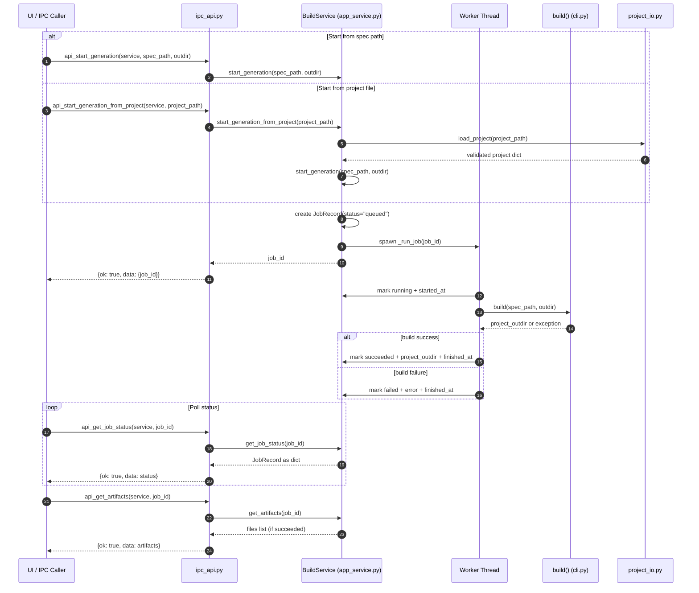

# IPC Flow Diagram

This diagram shows how UI/IPC calls move through API wrappers, job orchestration, and CAD generation.

## Keep This Updated

When adding new behavior, update this diagram in the same PR if any of these change:

- New IPC entry points in `ipc_api.py`
- New service methods or job state transitions in `app_service.py`
- New project-loading paths in `project_io.py`
- New generation/export stages in `cli.py` (or modules called by it)
- New error categories returned to IPC clients
